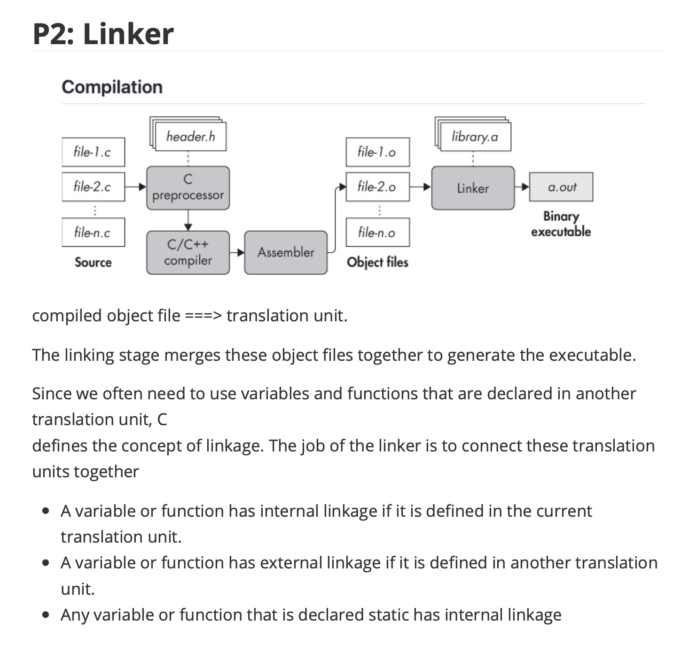

# COMP2017-Guidance

> © 2022. All rights reserved. This material is intended for educational purposes only and may not be used for commercial purposes. I hope this resource helps everyone excel in this unit 😊. If you notice any errors or have suggestions for improvement, please submit a pull request. All tutorial answers have been crafted by me. 

## PDF Version

For the PDF version, please refer to the folder `PDF Files`. For any hidden answer by Toggle button `>` , please refer to the markdown version.

## Markdown Version

If you find some mistakes, you can edit this version and submit the Pull Request

## Tutorial Answers

^ There are no official answers, all tutorial sheets answers are written myself.

