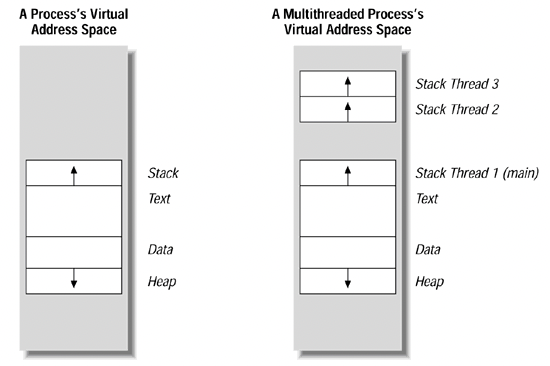
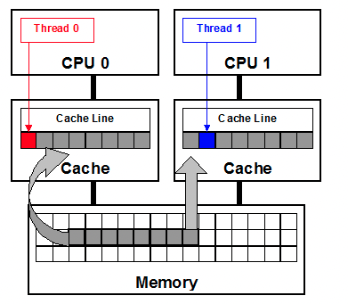
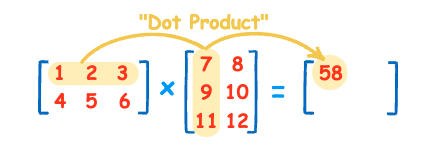
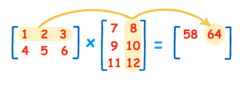

# Week 10


## P1: Task parallelism  VS Data parallelism

<u>Easy to understand but the key point when programming parallelism Question4 Tutorial !!</u>

*Task-parallelism*: 

​	parallelism achieved from executing different tasks at the same time (i.e., in parallel).

*Data-parallelism*: 

​	performing the same task to different data-items at the same time

*Dependencies*: 

​	an execution order between two tasks Ta and Tb. 


Example from Lecture

```
1. read file

2. sort data on string length
3. search for all string with substring "abc"

4. write sorted data on out1.txt
5. wirte subrtings found on out2.txt
```

<center class="half">
    
</center>


<center class="half">
  
  
</center>


## P2 Thread

### Memory for the thread



+ There has always been one thread per process  (main thread)

+ Can we return address of local variable in one thread ? Why 
  
  + **A thread has it’s own thread id, program counter, registers, <u>stack</u>** 
  + <u>The thread stack, program counter, and local method area are also stored in the address space of the process, but these  belongs to a specific thread. However if some array is out of bounds, it is possible to access the stacks of other threads, which may cause exceptions of other threads.</u>
  
+ A thread shares the virtual memory of a process with all other threads 

  + Shares heap 
  + Shares static 
  + Shares code 

  


### Usage

#### Basic

```c
#include <stdio.h>
#include <unistd.h>

// lib
#include <pthread.h>

// structure for thread info
pthread_t my_thread;

// function for thread
void* threadF (void *arg) {
	printf("Hello from our first POSIX thread.\n");
	sleep(60);
	return 0;
}

// once main start, there is a main thread start
int main(void){
  // create a thread, and the new thread will execute at the same time
	pthread_create(&my_thread, NULL, threadF, NULL);
  
	printf("Hello from the main thread.\n");
  
  // wait for one thread to finish
	pthread_join(my_thread, NULL);
	return 0;
}
```

+ To compile this program,you need to specify ` -pthread`
+ `ps -T -p <pid> ` to show thread in terminal
+ Thread-safe for the `printf`
+ We do not know the order for two threads, it's random


##### pthread_create


+ no implied hierarchy or dependency between threads **<u>except the main thread</u>**, all threads depends on the process image

##### pthread_join


#### Pass arguments

<u>How to pass arguments to the thread function ?</u>

As we can see, whatever we want to pass, we need cast the point into (void *) and then in the thread function, we cast the point back to the original type can dereference.

What if we want to pass mult-arguments ?

-- create a structure

```
Struct {

	int
	float

}
```


*CounterExample*


#### Terminate

There are three ways to terminate a thread: 

1) a thread can return from his start routine 

2) a thread can call pthread_exit() 

   ```c
   void* threadFunction(void* p){
   	if (...){
       // get some error
       pthread_exit(1);
     }
   }
   ```

3) a thread can be cancelled by another thread. In each case, the thread is destroyed and his resources become unavailable.

   

Notice:

+ dynamic memory allocated by the thread (malloc)
+ **close files that have been opened by the thread.**
  + The file descriptor may be created in thread function as a local variable. Once we terminate the thread, it is dangerous to forget close it.

+ `exit()` terminates the whole program, including all threads.
+ <u>do not return address of local variable in thread function.</u>

+ Ordering does not matter for terminating. Just make sure they all terminated


> Hello_from_threads
>
> Q1, Q2, Q3


## ## Understand the code => Q3.1    Q3.2     15 minutes 


## => 8:45    


### Mutex

Synchronise 


#### Race condition

```c
#include <stdio.h>
#include <string.h>
#include <pthread.h>

/*	
	Use two threads to print the message
	So, we need a shared cursor accessible by two threads.
	
 */ 
char *message = "Chocolate microscopes?abcdefghijklmnopqrstuvwxyz";
int mindex = 0;
size_t message_len = 0;
pthread_t my_thread;

void* threadF(void *arg) {
  while (1) {
    if (mindex < message_len) {
      printf("%c", message[mindex]);
      mindex++;
    } else
      break;
  }
  printf("Thread end at %d.\n", mindex);
  return NULL;
}

int main(void) {
  message_len = strlen(message);
  pthread_create(&my_thread,NULL,threadF,NULL);
  while (1) {
    if (mindex < message_len) {
      printf("%c", message[mindex]);
      mindex++;
    } else {
      break;
    }
  }
  printf("main end at %d.\n", mindex);
  pthread_join(my_thread, NULL);
  printf("\n");
  printf("all threads ended: %d.\n", mindex);
  return 0;
}
```


```
thread work(){
	mindex += 1;
}

two thread to execute this worker

```


+ Attention: Line 19 must exist. Otherwise, deadlock may happen


## P3: Performance Optimisation 

#### Cache

CPU is too fast, but the speed for memory access is slow. When we need some duplicated resources, CPU need to retrieve from memory again. (Slow)


CPU  <===> Memory


So there is a space called `cache` between CPU and memory, which is faster than memory. So we can put the data from memory to `cache`, when CPU need that resources again, just retrieve from the faster `cache`


So if you do some very frequent operations, make sure the data is in the **<u>L1 cache.</u>**


> **<u>The cache is made up of cache lines, usually 64 bytes</u>**

We just want to get `a` =

| a | b |  xxxxx| => in one 64 bytes ==> memory

| a |b | ==> this is in L1 cache


Another benefit:

+ Assuming `a` and `b` are stored continuously
+ One thread of core CPU just want to retrieve `a`. At the same time `b` is also additionally loaded into the cache line.
+ So after this, if it wants to retrieve `b`. No need to retrieve from memory, Just cache !  <u>(prefetch)</u>  => faster


But......

## False sharing

+ What if one thread[1] of core CPU is reading `b`  repeatedly and the other thread[2] is writing `a` repeatedly ?

+ Change `a` will make the entire cache invalid ! And thread1 has to read `b` from memory again, even `b` has nothing to do with `a`

  

  ##### Question:

  + Which one is more likely to cause false sharing ？
    + Structure or linked list 


#### Usage: 

Matrix Multiplication:

```c
How to do martix multi
  
(i, k) * (k, j) = (i, j)
  
  

// 1. Think about the result it's (i, j) so 
	for i in xxx:
		for j in xxx:
			// one element in result = sum(every element in one line * every element in one column)
			for k in xxx:
				C[i][j] += A[i][k] * B[k][j]
```






Usually, we do this

AB = C


```c
// the inner loop will be traversed firstly
/*
	Consider A, for i {for k} => so k will be traversed from start to end => by line
  Consider B, for j {for k} => so k will be traversed from start to end => by column
  Consider C, for i {for j} => so j will be traversed from start to end => by line
*/
for i in xxx:
    for j in xxx:  // consider result order firstly j from 0-j
        for k in xxx:
            C[i][j] += A[i][k] * B[k][j]
```

+ In this method, both `A` (traverse all `k` -> traverse all `i`) and `C` can take advantage of the cache => get by row =>prefetch

+ But for `B`, since we access `B` column by column, prefetched row data is unused, and we have to retrieve from memory


**How to solve that ?**


```c
for i in xxx:
    for k in xxx:
        for j in xxx:
            C[i][j] += A[i][k] * B[k][j]
```


In Q4, `y` is `i`, `x` is `j`


# DO Q3.3 until  9:29


### How can we split matrix multiple into different parts?

What we do is one whole line (length: k) * one whole column (length: k), so we can split this into different parts.


So this should be fixed in thread_worker.


What we do here is split A

Two 

```
1 2 3							7 8
3 4 5       *			9 10
            			11 12
```


<u>Which  feasible ? ?</u>


Way1:

```
 1 |2 3							7 8
 3 |4 5				* 		9 10
            				11 12       				
```

Way2: 

```
 1 2 3							7 8
 -------       *		9 10
 3 4 5            	11 12
```

So here, we'd better splitting by row (`y`)


#### Memory load/store

Assuming this one will be executed for 999999... times

```c
void encrypt_tea(uint32_t plain[2], uint32_t cipher[2], uint32_t key[4]) {
    //  little endian
    int sum = 0;
    int delta = 0x9E3779B9;
    cipher[0] = plain[0];
    cipher[1] = plain[1];

    for (int i = 0; i < 1024; i++){
        sum = (sum + delta) % two_power_32;
      // load and store
        int tmp1 = ((cipher[1] << 4) + key[0]) % two_power_32;
        int tmp2 = (cipher[1] + sum) % two_power_32;
        int tmp3 = ((cipher[1] >> 5) + key[1]) % two_power_32;
        cipher[0] = (cipher[0] + (tmp1 ^ tmp2 ^ tmp3)) % two_power_32;
        int tmp4 = ((cipher[0] << 4) + key[2]) % two_power_32;
        int tmp5 = (cipher[0] + sum) % two_power_32;
        int tmp6 = ((cipher[0] >> 5) + key[3]) % two_power_32;
        cipher[1] = (cipher[1] + (tmp4 ^ tmp5 ^ tmp6)) % two_power_32;
    }
 
    return;
}
```


+ How to speed up ?


```c
void * thread_encrypt_tea_ctr(void * argv){
    INFO *info = (INFO *) argv;
    int delta = 0x9E3779B9;
    for (uint32_t i = info->start_block_index; i < info->end_block_index; i++){
        uint64_t tmp = i ^ info->nonce;
    
        uint32_t * tmp_ptr = (uint32_t *) (&tmp);  

        int sum = 0;
        // Reduce the memory load
        for (int j = 0; j < 1024; j++){
            sum = (sum + delta) % two_power_32;
            (*(tmp_ptr)) = (
                (*(tmp_ptr)) + 
                (
                    ((((*(tmp_ptr + 1)) << 4) + info->key[0]) % two_power_32) ^ 
                    (((*(tmp_ptr + 1)) + sum) % two_power_32) ^ 
                    ((((*(tmp_ptr + 1)) >> 5) + info->key[1]) % two_power_32)
                )
            ) % two_power_32;


            (*(tmp_ptr + 1)) = (
                (*(tmp_ptr + 1)) + 
                (
                    ((((*(tmp_ptr)) << 4) + info->key[2]) % two_power_32) ^ 
                    (((*(tmp_ptr)) + sum) % two_power_32) ^ 
                    ((((*(tmp_ptr)) >> 5) + info->key[3]) % two_power_32)
                )
            ) 
            % two_power_32;
        }
        *(info->cipher + i) = *(info->plain + i) ^ (*(tmp_ptr) + (((uint64_t) *(tmp_ptr + 1)) << 32));
    }
    return NULL;

}
```

