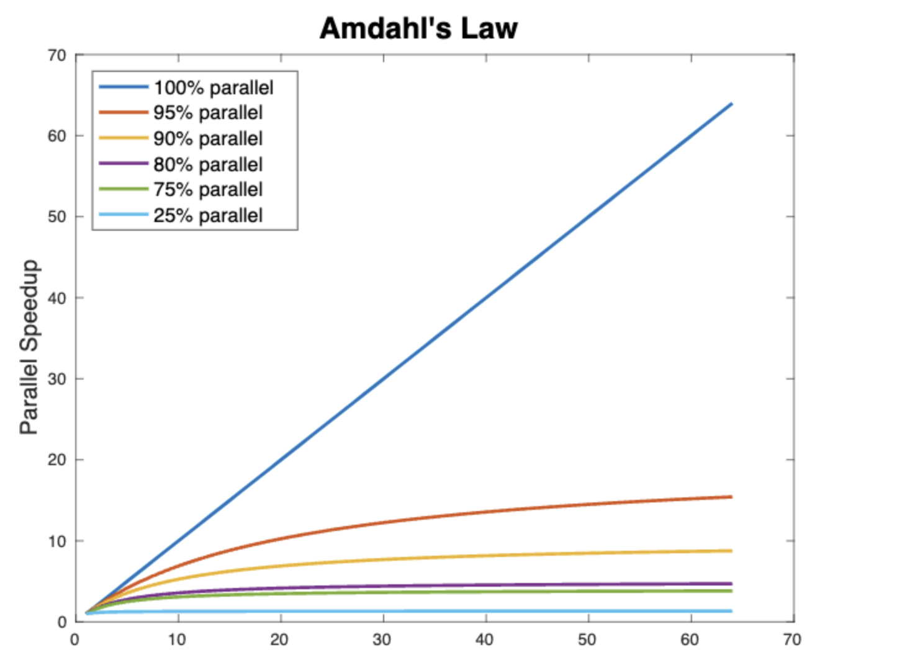

# Week 11


# Start at 8:05


## P1: Interleavings of Threads

**Critical section**:Two or more code-parts that access and manipulate shared data (aka a shared resource).

**Race condition**: “a situation in which multiple threads read and write a shared data item and the final result depends on the relative timing of their execution”.


## P2: Lock-based Thread Synchronisation

### Mutex

> Example

#### Blocking

```c
pthread_mutex_t mylock = PTHREAD_MUTEX_INITIALIZER;

void * thread_function(void * arg) {
  	/* 
  		Assume There are 3 threads.
  		
  		T1 locks and executing critial section
  		T2, T3 are waiting in the line `pthread_mutex_lock(&mylock);`
  		
  		Do not know after unlock mutex which thread will execute (order)
    */
  
    pthread_mutex_lock(&mylock);
  	counter = counter + 1; //critical section
  	pthread_mutex_unlock(&mylock);
}
```


#### Non-blocking

```c
pthread_mutex_t mylock = PTHREAD_MUTEX_INITIALIZER;

void * thread_function(void * arg) {
  	/* 
  		Assume There are 3 threads.
  		
  		T1 try lock successfully and this function locks automatically and executing critial section
  		T2, T3 try lock fail and printf("Unscu...."), continue executing
    */
    if ( 0 != pthread_mutex_trylock(&mylock) ) {
      printf("Unsuccessful attempt to acquire lock\n");
      
      // #######  pthread_mutex_unlock(&mylock); // Error: mutex not acquired!  ==> Only the thread that owns a mutex should unlock it! #########
      // what happens => unlock thread2
      
      
    } else {
      	// critical section start:
      	//...     ==>  thread1 still goes here => can cause race condition as well
      	// crtical section end
        pthread_mutex_unlock(&mylock);
    }
}
```


#### Dynamic creation of mutexes

```c
pthread_mutex_t * mylock;

mylock = (pthread_mutex_t *) malloc(sizeof(pthread_mutex_t));
pthread_mutex_init(mylock, NULL);

...
  
pthread_mutex_destroy(mylock);
free (mylock);
```


### Serialization 

```c
/*
	Part 1, Serialization: one thread has to wait another
*/
unsigned long counter=0;

void * thread_function(void * arg) {
  long l;
  for (l=0; l < MAX_ITER; l++) {
    
    pthread_mutex_lock(&mylock);
    counter = counter + LongComputation();
    pthread_mutex_unlock(&mylock);
  }
}


/*
	Part 2, Reduce Serialization 
*/
unsigned long counter=0;

void * thread_function(void * arg) {
  long l, tmp;
  for (l=0; l < MAX_ITER; l++) {
    
    tmp = LongComputation();
    
    
    pthread_mutex_lock(&mylock);
    
    counter=counter+tmp;//crit.sect.
    
    pthread_mutex_unlock(&mylock);
  }
}
```


## P3: DeadLock

### Example

```
T1													T2


cat 1												fox 1
dog	2												dog 3 (blocking)
fox (blocking)


Can not reach next,  can not continue to unlock

free...											free...

```


### Necessary conditions for a deadlock

1. Mutual exclusion: a resource can be assigned to at most one thread. 
2. Hold and wait: threads both hold resources and request other resources.
3. No preemption: a resource can only be released by the thread that holds it.
4. Circular wait: a cycle exists in which each thread waits for a resource that is assigned to another thread. 


### Deadlock Prevention

Cycles can prevented by a locking hierarchy:    ==> breaking rule 4

1. Impose an ordering on mutexes.
2. Require that all threads acquire mutexes in the same order.

===> a special case


**Example: Dining Philosopher’s Deadlock** (Skip this)


Hold and wait ==> breaking rule 2

```
T1													


cat 	
	operation(cat)
dog						
	unlock cat
	lock(dog)
	operation(dog)
fox 
	unlock dog
	lock(cat, fox)
	operation(cat, fox)
	


```

> Week11/Q1, Q2


# 9:01 5 mins break


 Describe how your exchange works.

   Initialize first, execute each trader file individually, create and open the pipe, register the signal handler, and fire the signal handler when SIGUSR1 is received.Process order commands from Trader.If the order completes, then send SIGUSR1 signal to trader.I saved all the orders in the order list, and I also used waitpid() in the event loop, which I immediately removed when I checked for a finished child process(trader) according to the return value of waitpid().To avoid zombie processes, when Waipid detects that all child processes have died, close the named pipe, delete the pipe file, free up all memory, and close Exchange.
3. Describe your design decisions for the trader and how it's fault-tolerant.

   When receiving an order notification from SPX, first receive SIGUSR1, then parse the string, judge according to the string information, if the number is greater than or equal to 1000, directly disconnect. Otherwise you need to reply SPX with the same message as before except for the order type (if order from SPX is buy order, need to send an order to SPX).Because we need to consider the case of exchange lost signal sended by trader due to busy.Therefore, if the AT does not receive the ACCEPTED or FILL message within a certain period of time after sending the signal to SPX, the AT should repeatedly send the SIGUSR1 signal to SPX. Here I use select() to determine whether the signal needs to be sent again according to the return value of select, and I use exponential back off  Algorithm to set an dynamic timeout avoid to a fixed timeout.
4. Describe your tests and how to run them.


### Starvation and Live-lock (Extension)

Starvation happens when “greedy” threads make shared resources unavailable for long periods. For instance, suppose an object provides a synchronized method that often takes a long time to return. If one thread invokes this method frequently, other threads that also need frequent synchronized access to the same object will often be blocked.


## P4: Lock Contention and Scalability

+ Coarse-grained lock    => a lock for the whole linked list => no parallel => we can not do search in parallel  

+ Medium-grained lock.

+ **Fine-grained lock.**

  

  

  ```
  lock A ?
  --- No
  
  lock B ?
  --- No
  
  lock C ?
  --- Yes      ==> the other thread can not access nodes after C
  						 ==> some race condition may happens when two threads both inserting 
  						 			after C without lock 
  
  lock D as well
  update(C, D)
  
  unlock C, D
  ```
  
  


## P5: Semaphores

Semaphores are non-negative integer synchronization variables.

If you want to do something with an order. 

Something like wake up using signal are without order


```c
s has some init value maybe 0

  

V(s): [ s++; ]             ==> sem_post
  
  

P(s): 
[ 
  while (s == 0) {
    wait();
  }
  s--; 
]                          ==> sem_wait

 


The statements between brackets [ ] are therefore an atomic
operation.
==> At any time, only one P() or V() operation can modify s.
```

Example:

```c
#include <semaphore.h>
#define MAX 4
#define MAX_ITER 50000000

pthread_t thr[MAX];
sem_t s;
long counter = 0;

void * tfunc (void * arg) {
  int i;
  for (i=0; i<MAX_ITER; i++) {
    sem_wait(&s);
    counter++; //critical section
    sem_post(&s);
  }
}
int main() {
  int i, j;
  sem_init(&s, 0, 1);
  ...
}
```


Question: what happens if T1 executes sem_post() before T2 executes sem_wait() ?


> Week11/Ping-Pong , Q3 & Q4
>
> Before Q4, Intro Barrier


## 15 mins for Q4 back at 9:50 


## P6: Amdahl’s Law 


(1 - p) => the part can not be parallelised 

P => the part can be parallelised, and we have n workers.


If 100% => p = 1 => speed = n (linear)



> Week11/Q2
