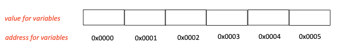
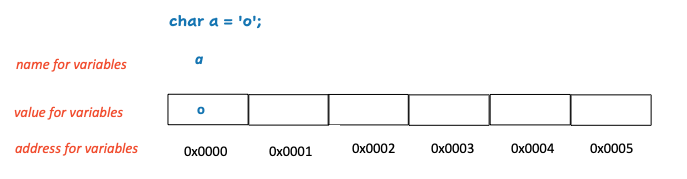
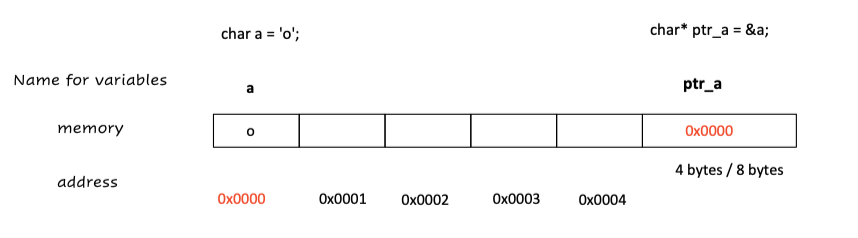
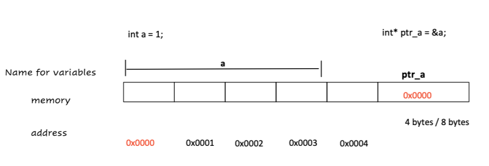
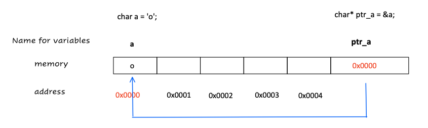
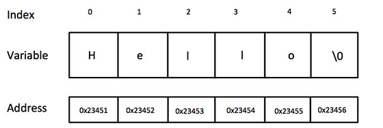
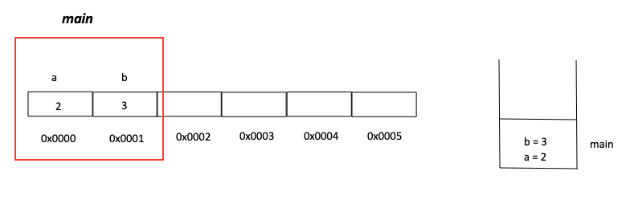
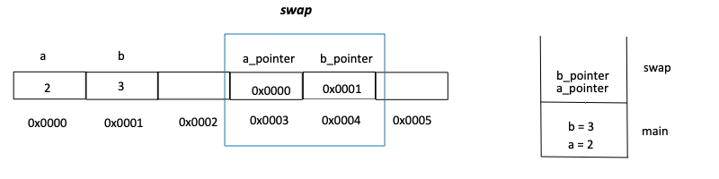
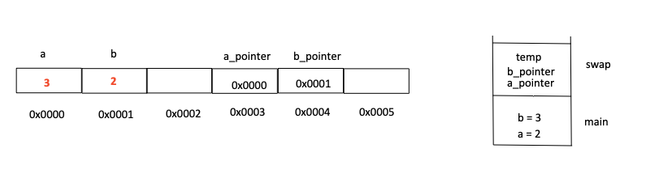
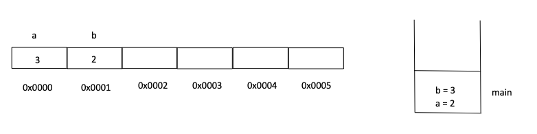

# Start  8:05 am.

## Please scan the attendance QR code


# Welcome！

My name: Jiahao Chen  (Conor)

Email: jiahao.chen1@sydney.edu.au


Structure:

Revision / summary

Go through T Questions


introduce yourself and tell a bit about your major / favourite food / interest in CS/.......

Text/verbal


Attendance Link:

https://edstem.org/au/courses/7900/lessons/20189/slides/143881


# Week 2

## Part1 : Pointer

### Memory 




```
Hexadecimal: with prefix 0x
```





<u>***(Notice: Different types need different number of bytes and this may varies in different OS)***</u>


### How to get the address ?

```c
char a = 'o';
printf("%p", &a);

// 0x0000, starting address for this variable
// virtual address => Week8
```


### What's the pointer ?

pointer is similar with address. To more specific, it is a variable stores the address (**<u>starting address for some variable</u>**).

```c
/*
	variable name: pointer_a
	type: char* (a pointer/address to a char)
*/
char a = 'o';
char* ptr_a;       // the same as char *ptr_a;  * means it is pointer(variable stores address), char means the type of pointer is char (address stores char)
ptr_a = &a;
```

0x0000 is the address which stores the value 'o' whose type is char.

**<u>In 32-bit OS, address needs 4 bytes, in 64-bit OS, address needs 8 bytes</u>**







> Check address and value 

### How to retrieve  the value ?

```c
// *ptr

printf("%c", *pointer_a);

// will print o
// since the type is char*, the computer only cares about 1 byte from statring address
//													If the type is int*. It will do `from the starting address, let see 4 bytes`
```


`*` : **define a pointer** VS **dereferencing** 

The previous one is used to define a pointer. `int a = 10; int* ptr = &a;`

The * here is called **<u>dereferencing</u>** operations (*) which allows retrieval of the value stored at the address. `int num = *ptr;`




### Notice

```c
int* pointer;
// We can get access the memory, but we do not know what stores there (unknown)

int* pointer = NULL;
// we can check for as a default/uninitialized value
if (NULL != pointer){
// do something
}
```


## Part2: Array and string

1. All the elements in the array should be the **same type**
2. the memory layout for the elements in array are **contiguous**.

```c
/*
	Declaration
*/

// type name[constant] ==> the complier needs to know how many memory you need
int a[2];
char arr[5];


/*
	Initialisation 
*/
int integers[2] = {1, 2};
a[0] = 1;

// The compiler can determine the required size 
int ignore_constant[] = {1, 2};

//############
// Do not use variable length array
//############
```


There is not `string` type in C, we can use char array to represent string.

`Terminating character.`

```c
// string = char array end with '\0'
char myHobby[] = "rowing";    // size 
char myHobby[] = {'r', 'o', 'w', 'i', 'n', 'g' , 0};
```

<details>
<summary>Answer</summary>
  7 ==> because \0 </br>
6
 </details>

```c
printf("%d\n", '\0'); // ==> 0 == '\0'
```

> Tutorial/Week2/Q3
>
> Tutorial/Week2/Q5.1




+ What happens ?

```c
#include<stdio.h>
// part of Tutorial/Week2/Q5.1
int main(){
    
    char array2[] = {'H', 'e', 'l', 'l', 'o'};
    char array1[] = "hello";
   
  	// check address
    printf("%p\n", array2 + 4);
    printf("%p\n", array1);
    
    printf("%s\n", array2);
    return 0;
}
```

<details>
<summary>Answer</summary>
  // Hellohello </br>
 </details>


### Sizeof

```c
/*
	return type: size_t => to represent the size of obejct       <stddef.h>
	
  1) sizeof( object );
  2) sizeof( type_name );
*/


#include <stdio.h>
#include <stddef.h>

int main(){
    printf("%zu\n", sizeof("abc"));
 
  
    printf("%zu\n", sizeof(char*)); // 8/4
  
    printf("%zu\n", sizeof(int*)); 
  	printf("%zu\n", sizeof(int)); 
  
   	printf("%zu\n", sizeof(void*));
  
  	int arr[2];
  	printf("%zu\n", sizeof(arr)); // 2 * 4 = 8
  	// In general, void is a incomplete type, and you cannot use sizeof for incomplete types, but gcc get 1
  	
}

// use sizeof to count the len of array
sizeof(arr) / sizeof(type_in_array)
```

> Tutorial/Week2/Q5.2


// 10mins Back at 51


## Part3: Array and Pointer

1. We can get a pointer of the first element in a array through the name of array

   ```c
   int arr[5] = {1, 2, 3, 4, 5}; // &arr[0]
   
   arr   // it is a pointer points to 1. type is int*
   &arr[0]
     
     
   arr[0] // *(arr)
   arr[1] // *(arr + 1), since the type is int*, the computer knows it need 4 bytes to get the next element
   ```

2. What about `&arr` ?

   The value of  `arr` and `&arr` are the same, starting address for the array

   > Try

   type is different, `arr` is the pointer for the first element (type ?). `&arr` is a pointer for the whole array  (type ?)

   

   When adding or subtracting an integer from a pointer, the former uses one element as one step(granularity), and the latter uses the entire array as the granularity.

3. Check

   ```c
   // 3 minutes
   #include <stdio.h>   
   int main()   
   {   
     int  a[5] = {1, 2, 3, 4, 5};   
     int *ptr =  (int*)(&a + 1);   // (int*)
     printf("%d %d" , *(a + 1), *(ptr - 1));   
   } 
   ```
   
   <details>
   <summary>Answer</summary>
    >>> 2  5
    </details>

> Tutorial/Week2/Q5.3, Q6


> Tutorial/Week2/Q5

**<u>*Difference*</u>** 

```c
#include <stdio.h>

int main(){
    char* ptr = "abcd";
    char array[] = "cdef";

  
    /*
        char a[] = "abcd"           char* p = "cdef"
        
        a is an array               p is a pointer  

        sizeof(a) = 5              sizeof(p) = 8 / 4

        "abcd" in stack             p is in stack, "cdef" in code section (can not modify)

        value &a same with a        p not same with &p

        a = "hello" invalid         p = "hello" valid
        since a is address          
        we can not change address

        a[0] = 'c'  valid           p[0] = 'c' invalid
        array stored in stack        code section read only
        during the runtime, writeable                           
    
    */
    
}
```


## Part 4: char** argv  

```c
// ./a.out argv1 argv2  => how to represent string array
int main(int argc, char** argv){}
int main(int argc, char* argv[]){}

// ########## Tutorial Q4 #########
/*	
		+ char* p
			1. Address to a single char value
			2. Address to a single char value that is the first in an array => starting address of one string, so  is the similar as char p[]
			
			char p[]   char* p ==> so char* can represent string
			
			
		+ char* (argv[])  
			1. an array whose elements are char*  =>    printf("%s\n", argv[1]); => string array
			|a1|a2|a3|
      
      |'a'|'r' |'g' |'v' |'1' | '\0'|
      	a1
      	
      |'a'|'r' |'g' |'v' |'2' | '\0'|
      	a2
      	
      |'a'|'r' |'g' |'v' |'3' | '\0'|
      	a3
			Array of “the type” with unknown length
			- Type is char *
        
        
    // receive char*
    printf("%s\n", argv[1]);   ==> type is char*
    printf("%s\n", *(argv + 1)); ==> type of argv is char**, deference it once
       			
*/
```

> Tutorial/Week2/Q2, Q4


## Back  9:52


____

> Tutorial/Week2/Q7, 8, 9, 10, 11

Parameters are passed by value in C

In the C language, when a one-dimensional array is used as a function parameter, the compiler always resolves it as a pointer to the first address of its first element.

### Question 7: Swap

```c
void swap(int* a, int* b) {
  //
  // TODO
  //
}

int main(void) {
  int a = 2;
  int b = 3;
  swap(?, ?); //Specify the variables to swap
  printf("%d %d\n", a, b); // should print 3 2
  return 0;
}
```

-----

// 10 minutes for discussing

----

Answer:

```c
#include <stdio.h>

void swap(int* a_pointer, int* b_pointer) {
    int temp = *a_pointer;
    *a_pointer = *b_pointer;
    *b_pointer = temp;
}

int main(void) {
    int a = 2;
    int b = 3;
    swap(&a, &b); //Specify the variables to swap
    printf("%d %d\n", a, b); // should print 3 2
    return 0;
}
```

Just for the convenience to explain, the reality is `int` usually needs 4 bytes, and address takes 8 bytes.











## Extra

### Void*

A special pointer, "no type pointer"

#### Usage of `void*`

If the parameter of the function can be any type of pointer, its parameter should be declared as `void*`

```c
void *get_address( sometype *data , int n) {
  unsigned char *ptr = (unsigned char*)data;
  return (void*)(ptr + n);
}
// avoid do +/- in void*, some complier does not accept

/*
	Why we use unsigned char as a type of BYTE ?
	size
	Generally unsigned chars are used when you don't want a sign. This will make a difference when doing things like shifting bits (shift extends the sign).

*/
```

```c
#include <stdio.h>

int main(){

    int a = 123456;
    int* ptr_a = &a;
    unsigned char* byte_ptr = (unsigned char*)ptr_a;
    printf("%x, %x, %x , %x", *byte_ptr, *(byte_ptr + 1), *(byte_ptr + 2), *(byte_ptr + 3));
}

>> 40, e2, 1 , 0
  // 123456 = 1 E2 40
```


### a++ VS ++a

```c
#include <stdio.h>
int main()
{
    int a = 12, b = 1;
    int c = a - (b--);  
    int d = (++a) - (--b);  
    printf("c=%d, d=%d\n", c, d);
    return 0;
}
```

`c=11, d=14`


## There may be some errors! If you find it, please contact me by the email. Thanks

