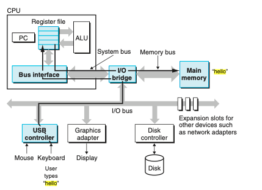
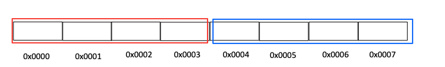
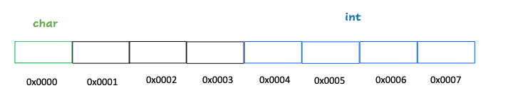
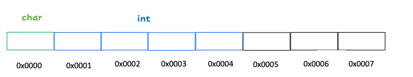
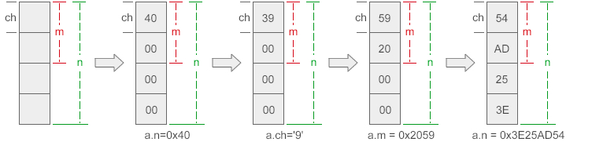
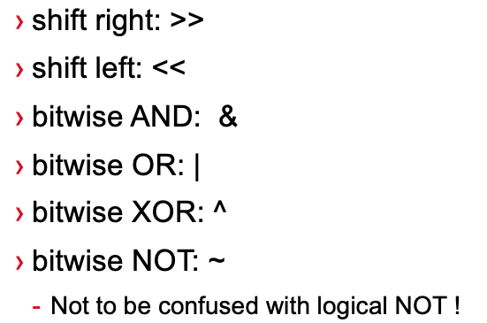
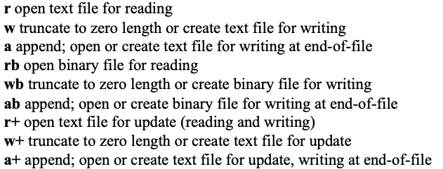

# Start at 8:05pm

# Please scan the QR code for attendance


# P1: Structure

## What structure for ?

hold a collection of data items of different types.

```c
int array[] = {1, 2, 3};

<type> mixed_arr = {1, 'x'};
```


## General Usage

### Syntax

```c
struct [tag]
{
		member-declarations
} [identifier-list];
```

```c
struct mixed 
{
	int num;
	char letter;
};

// Usually we declare structure and init like this
// struct tag identifier-list;  do not forget `struct`
struct mixed mixed_arr = {1, 'x'};


// Also, we can declare structures right after the brackets and before the semicolon
struct mixed 
{
	int num;
	char letter;
} mixed_arr, mixed_arr2;
// Demo 1_1


// Structure initialisation can be here as well
struct mixed 
{
	int num;
	char letter;
} mixed_arr = {1, 'x'};


// If we only need one structure mix_arr and do not need declare more structures.
// We can ignore the tag
struct
{
	int num;
	char letter;
}mixed_arr;


struct tag name..
  
// rename , simplify
struct mixed
{
	int num;
	char letter;
};


typedef struct mixed MIXED;

MIXED arr = {1, 'x'};
MIXED arr = { .letter = 'x', .num = 1};


// can be written like this as well
typedef struct mixed
{
	int num;
	char letter;
}MIXED;


```

### How to access the field in structure ?

```c
mixed_arr.number   // 1
mixed_arr.letter   // x
```

### Pointer for structure

```c
struct mixed mixed_arr = {1, 'x'};
struct mixed* ptr = &mixed_arr;


//Usually we use the arrow
mixed_arr.number
ptr -> number


// The same as follow ?
// ######################################################################################
*ptr.number  ??
// ######################################################################################

```

Answer:

```c
// This will cause some error, why ??  
// This operation equlas to *(ptr.number). First, offset. Then dereference
  
  
// access the field
(*ptr).number
// 
  
  
```

*9.12 - 9.13*


## Memory & Alignment


### Alignment

How many bytes CPU can read at one time depends on the size of the bus to the main memory.

> - The **width** of the **databus** determines the **amount of data** transfered per **memory operation**



Assuming the CPU can only read 4 bytes at one time 



```c
struct st {
	char letter;
	int number;
};
```

1. With Alignment

   Access `int`

   

2. Without Alignment

   CPU need read twice for the INTEGER.  And need extra operations to concatenate the info of int

   

​					

###  Order matters

```c
struct st {
  // int: 4bytes
	char letter; // 1 byte
	char c;		   // 1 byte   + 2 padding
	int number;  // 4 bytes
}; // 8 bytes
```

```c
struct st {
   // int: 4bytes
	char letter;   // 1 b + 3
	int number;	   // 4
  char c;        // 1 + 3
}; // 12
```

+ Which one has smaller size ?

> Padding content has no guarantee to be 0


> Alignment means a variable V has to be put at address divisible by sizeof(V).	

### Rules for struct

> http://www.catb.org/esr/structure-packing/  (The Lost Art of Structure Packing) 
>
> specific principles

**<u>In general, a struct instance will have the alignment of its widest scalar member.</u>** 

> aggregate types: structure, array     

See previous two example


+ Another example

```c
// in 64-bit OS pointer:  8 bytes
struct foo5 {
    char c;          // 1byte

    struct foo5_inner {
        char *p;      // 8 bytes
        short x;      // 2 bytes
        char pad2[6];  // 1 * 6 bytes
    } inner;
};

```

*9.16*

For 3 minutes


*9.20*

Answer

```c
struct foo5 {
    char c;           /* 1 byte + 8 */    // 8 bytes

    struct foo5_inner {
        char *p;      /* 8 bytes */    // align by the largest scalar member 8
        short x;      /* 2 bytes */
        char pad2[6]; /* 6 bytes */ 
    } inner;
};

// 24 bytes

/*
  The char *p member in the inner struct forces the outer struct to be pointer-aligned as well as the inner.
*/
```

*9.21*


# P2: Union

The difference between a structure and a union is: each member of the structure occupies different memory and has no influence on each other; while all members of the union occupy the same memory, modifying one member will affect all other members.


So the memory occupied by the union should be enough to store the largest member of the union. ( + padding as well) 

```c
#include <stdio.h>

union data{
    int n; // 4
    char ch;  // 1
    short m; // 2
};

int main(){
    union data a;
    printf("%zu, %zu\n", sizeof(a), sizeof(union data) );
    a.n = 0x40;     
    printf("%X, %c, %hX\n", a.n, a.ch, a.m);
    a.ch = '9'; 
    printf("%X, %c, %hX\n", a.n, a.ch, a.m);
    a.m = 0x2059;
    printf("%X, %c, %hX\n", a.n, a.ch, a.m);
    a.n = 0x3E25AD54;
    printf("%X, %c, %hX\n", a.n, a.ch, a.m);
   
    return 0;
}

/*
	"%X": Unsigned hexadecimal integer (uppercase)
	"%hX" h is length "short"
	0x40 = 64 decimal => check ASCII @
	'9' ASCII  39

*/
```




```
4, 4
40, @, 40
39, 9, 39
2059, Y, 2059
3E25AD54, T, AD54
```


> Tutorial/Week4/Q1, Q2, Q3


Q3  10min

```c
struct customer{
	char name[100];
	char object[100];
	int age;
}
```


# Back at 8:53

## 


## **5 minutes break**

## Back at 9:05


# P3: Bitfield

**1 byte = 8 bits**

Compress memory

Specify a size, in bits, for elements of a structure

```c
struct bs{
    unsigned m;
    unsigned n: 4; // maximum 1111 = 15    4bit
    unsigned char ch: 6; // max 111111 = 63   6bit
};

// unsigned int  == unsigned
// Sometimes it will overflow

// The C language standard regulate that the width of a bit field cannot exceed the length of the data type to which it is attached
```


Some basic operations




### Memory

**Case 1: When adjacent members are of the same type**

Treat the size of original type as a unit

If member1 + member2 > size of original type  => member2 will be stored in other unit.

If member1 + member2 < size of original type  => m1, m2 are stored side by side

```c
#include <stdio.h>
int main(){
  // 4 bytes = 32 bits
    struct bs{
        unsigned m: 6;   // 6 bits
        unsigned n: 12;  // 12 bits
        unsigned p: 4;   // 4 bits
    };
    printf("%zu\n", sizeof(struct bs));
    return 0;
}

/*
	m, n, p are unsigned int => 4 bytes = 32 bits
	6 + 12 + 4 < 32. they will be stored side by side.
	
	if n:30.
	6 + 30 > 32.  n will be stored in another 32 bits.

*/
```

```c
#include <stdio.h>
int main(){
    struct bs{
        unsigned m: 6; // 4
        unsigned n: 30; // 4 
        unsigned p: 4; // 4
      
      // 6 + 30 + 4 = 40 bits
    };
    printf("%zu\n", sizeof(struct bs));
    return 0;
  // 12 bytes .... not good 
}
```


**Case 2: When the types of adjacent members are different, different compilers have different implementation schemes, GCC will compress storage, but VC/VS will not**


**Case 3:If non-bit field members are interspersed between members, no compression will be performed**

```c
#include <stdio.h>
int main(){
    struct bs{
        unsigned m: 12;
        unsigned ch;
        unsigned p: 4;
    };
    
    printf("%zu\n", sizeof(struct bs));
    return 0;
  // 12 bytes .... not good 
}
```


(Last year, there an extension for one assignment...)


# P4: Files in C


> **11.1.1 Streams and File Descriptors**
>
> When you want to do input or output to a file, you have a choice of two basic mechanisms for representing the connection between your program and the file: file descriptors and streams. File descriptors are represented as objects of type `int`, while streams are represented as `FILE *` objects.
>
> File descriptors provide a primitive, low-level interface to input and output operations. Both file descriptors and streams can represent a connection to a device (such as a terminal), or a pipe or socket for communicating with another process, as well as a normal file. [...]


+ How to operate file (Regular file)?

  + Open the file

    At this stage, get information about the file, such as file name, file status, current reading and writing position, etc., which will be saved in a **<u>FILE type structure variable</u>**

    ```c
    // file function defined in <stdio.h>
    FILE *fopen(const char *path, const char *mode);
    ```

    ```c
    FILE* myfile = fopen(“turtles.txt”, “w”); // "w" is the mode
    ```

    

    + Devices are often represented as files

      the keyboard is called the standard input file, scanf reads data from this file

      the monitor usually called the standard output file, and printf outputs data to this file

      ```c
      fscanf(stdin, …) same as scanf(…)
      fprintf(stdout, …) same as printf(…)
      ```

  + Do some operations

    + Read/write file

  + Close the file
  
    Free the structure variable, and prohibit operations on the file at the same time
  
+ To operate other files represents devices ---> `open` to get file descriptor (`open` is for Linux, not other systems)

> Q4 Together 5 min


## Back at 5:18


### Buffer

Buffer is **an area of memory used to temporarily store data** while it's being moved from one place to another.

#### Why buffer ?

Assuming you have some rubbish at home, do you directly throw it into the garbage room ?

Definitely not, you just throw it in your home rubbish bin until it's full. Then you throw all things to the garbage room.


Buffer is similar with "the home rubbish bin". 


***advantages:***

Frequency IO operation is harmful for the disk and will cause **delaying**. Combine multiple small/big data transfers into fewer batches of data transfers to reduce the extra overhead of the transfer process itself

......


#### Buffer mechanism

+ **No buffering**:  When you write characters to an unbuffered stream, the operating system writes them to the file as soon as possible.

  +  `stderr`

    

+ **Full buffering:** When you write characters to a fully-buffered stream, the operating system writes them to the file in blocks of arbitrary size.

  

+ **Line buffering**: When you write characters to a line-buffered stream, the operating system writes them to the file when it encounters a newline character.

  + `stdin/stdout` 

  


When do we flush the buffer to do the real IO ?

+ The buffer is full
+ Execute `fflush`
+ Close file


>  Week4/Q6, Q8, Q9, Q10

## Q6 for 10 mins Back at 9:37


A special demo:

```c
#include <stdio.h>
#include <stdlib.h>

struct flexi_example
{
  int data;
  char arr[];
};

int main(){
  	//  struct size is usually known at compile time
    printf("%zu\n", sizeof(struct flexi_example)); // 4


    struct flexi_example *obj;
    // achieve VLA
    obj = malloc(sizeof (struct flexi_example) + 5);
    free(obj);
}
```


