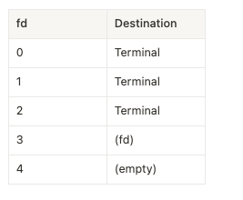
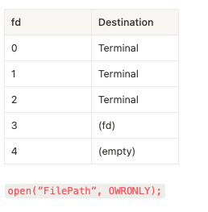
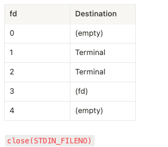
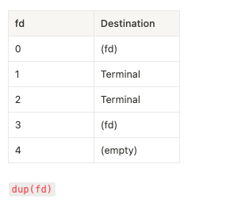
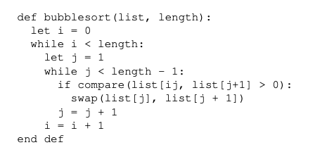

# Week 6


# Please scan the QR code for W6, Start at 8:05


## P1: Low level file I/O

### File

> A Linux *file* is a sequence of m bytes:
>
> ​				$B_0, B_1, . . . , B_k, . . . , B_{m−1}$


### System call

In order to better manage some resources (eg. File), the processes (eg. One of your running program) are not allowed to directly operate. Access must be controlled by the operating system. In other words, <u>the operating system is the only entrance to use these resources</u>, and this entrance is the system call provided by the operating system 

**File management** And Device management are part of system calls (You will see more in Week8)


**In general, when you do file operations in your code. It will request a service from the kernel of the OS to help you do the real operations.**


### File descriptor

+ Treat everything as file

+ System call functions operate on file descriptors

+ When a process starts.  file descriptor 0 is standard input, 1 is standard output, 2 is standard error output (UNIX)

  In the header file `<unistd.h>`, defines constants `STDIN_FILENO`, `STDOUT_FILENO`, and `STDERR_FILENO`

The kernel keeps track of all information about the open file. The application only keeps track of the descriptor.


### Buffer

Review in `Week4, T4`

> Part1


#### `open` VS `fopen`

| `open`                          | `fopen`                                          |
| ------------------------------- | ------------------------------------------------ |
| low-level IO                    | high-level IO                                    |
| returns a file descriptor       | Return FILE structure(FILE *)                    |
| unbuffered                      | buffered                                         |
| works with `read`, `write`, etc | works with `fread`, `fwrite`, etc. (`fscanf`...) |

+ The latter is an extension of the former, and in most cases, the latter is used.
  + When `fopen` we can use more functions like `fscanf` ... 
  + One day, your code is running in a non-unix-like system ...
  + However, the OS API may provide more power and finer control over things like <u>user privileges</u> etc.

+ Also, `write` will write binary file.


You are already familiar with `fopen`.

Usage of `open`

```c
#include <sys/types.h>
#include <sys/stat.h>
#include <fcntl.h>

int open(const char *pathname, int flags);


int open(char *filename, int flags, mode_t mode);


/*
    The descriptor returned is always the #####SMALLEST#### descriptor that is not currently open in the process. 
    
    when open and close, remember to check the return value
*/
```

The flags argument indicates how the process intends to access the file, must include one of them

+ O_RDONLY       reading only
+ O_WRONLY      writing only
+ O_RDWR	       read & write

.assets/image-20220323204434921.png)

```c
fd = Open("foo.txt", O_WRONLY | O_APPEND, 0); // Or (|) with one or more masks 
// mode is ignored (and can thus be specified as 0, or simply omitted
```


The mode argument specifies the access permission bits of new files.

.assets/image-20220323204141792.png)

> Details > Computer Systems A Programmers Perspective 10.3 and man page
>
> > Show an example/Part1.1


**In assignment1, some people forget to close file**


Tutorial/Week6/Q1


A question from last year. 










## P2: Function pointer

### Main idea

A function always occupies a contiguous memory area, calling function is almost the same as jump into another address. (jumping into the starting address of one function).

```c
#include<stdio.h>
// -S
void fuc(){
    int a = 10;
}

int main(){
    fuc();
}
```


So we can use a pointer to store the address of one function.

```c
returnType (*pointerName)(param list);

// How to get the address of function
double foo(double num){
  num += 1;
  return num;
}

// The same
double (*fun1)(double) = &foo;
double (*fun2)(double) =  foo;
// Whenever foo is used in an expression and is not the operand of the unary & operator, it is implicitly converted to a pointer to itself, which is of type double(*)(double)

// invoke
int plus_one = (*fun1)(1);
int plus_o = fun1(1);

```

https://stackoverflow.com/questions/9552663/function-pointers-and-address-of-a-function


### Typedef

```c
/*
  typedef: define a new type
  name => calli
  this type is a pointer points to a special function => return(int), parameters (int, int)
*/

typedef int (*calli)(int, int);

int add(int a, int b){
    return a + b;
}

int main(){
  calli fp = add;
}
```


### Usage

Function pointers can be useful when you want to create **[callback mechanism](https://stackoverflow.com/questions/6807376/call-back-routine)**, and need to pass address of a function to another function. (See in Week9)

They can also be useful when you want to store an array of functions, to call dynamically

> Example: Function pointer


## DO question2 ==> 20 mins Back  8:55


> Tutorial/Week6/Q2



Compare(list[j], ...)


Similar with Java Comparator


# Break 9: 10


## P3: Signals

### Basic

**signal is a Communication mechanism between processes.**

Scenario:

You are listening the music using Spotify. And you open Youtube as well. There are two processes which runs at the same time.

Then you open a video in Youtube, and the music in spotify paused. At this this, the process 'Youtube' send a signal to process 'spotify', said "stop music because I gonna play some video now"


> <u>The number may not corresponding to the signal (in the picture), see the macros in <signal.h></u>
>
> Eg. SIGUSR1


```shell
$ kill -<signal type> <pid>
# send the SIGKILL signal to prcocess with pid 12345
$ kill -9 12345
```

```c
#include <sys/types.h>
#include <signal.h>

int kill (pid_t pid, int sig);
```


### Catching Signals

```c
#include <signal.h>

void (*signal(int sig, void (*catch)(int)))(int);


# void (*catch)(int) ==> fp (xxx)


/*
	
	void (*signal(int sig, void (*catch)(int)))(int);
	void (*signal(int sig, fp)(int);
	
	+ if the return value is `int` ?
	
	// 	int signal(int signum, fp);
		
  + What if we want to return a function pointer ?
		void (*) (int)     signal(int signum, xxx);  
		
		adjust
		====>
		
		void (*signal(int signum, fp)) (int)
    
*/


typedef void (*sighandler_t)(int);  // then we can just use the 'sighandler_t' as the type for function pointer


sighandler_t signal(int signum, sighandler_t handler);


```

For the return value, more details https://jameshfisher.com/2017/01/10/c-signal-return-value/.

> Attention :
>
> 1. In the signal handler, it's better use `write()` rather than `printf()` since `write()` is async-signal-safe
>3. Signal behaviour can be overwritten


### Example => see tutorial

```c
#include <stdio.h>
#include <signal.h>
#include <time.h>
#include <unistd.h>

volatile int cont = 1;   // do not optimize, use the real value from memory. rather than register

void sigint_handle(int signum) {
  cont = 0;
  // break the loop
}


int main() {
  //  ctrl + c 
  signal(SIGINT, sigint_handle);


  while(cont) {
    pause(); // pause() will pause the current process (go to sleep) until it is interrupted by a signal.
    time_t t = time(NULL);
    struct tm* tm_info = localtime(&t); //statically allocated memory
    printf("%s", asctime(tm_info));
  }

  return 0;
}

```


Signal may be lost, so the handler need to be very quick

```c
// Another function if the previous not work
// sigaction is another way for handing signal

#include <signal.h>
int sigaction(int signum, const struct sigaction *act, struct sigaction *oldact);

struct sigaction {
  void (*sa_handler)(int);
  void (*sa_sigaction)(int, siginfo_t *, void *);
  sigset_t sa_mask;
  int sa_flags;
  void (*sa_restorer)(void);
};
```

```c
void sigint_handler(int signo, siginfo_t* sinfo, void* context) {
  printf("I was interrupted\n");
}

int main() {
  /* template for set up*/
  struct sigaction sig;
  memset(&sig, 0, sizeof(struct sigaction));
  
  sig.sa_sigaction = sigint_handler; //SETS Handler
  sig.sa_flags = SA_SIGINFO;
  
  // signal and handler function
  if(sigaction(SIGINT, &sig, NULL) == -1) {
    perror("sigaction failed");
    return 1;
  }
}
```


### Error checking: errno

Care about error checking using `errno`

```c
void* date = malloc(-1);  //error1 
free(data);								//error2

printf("errno is %d\n", errno);

// these two are different
// errno will update when some error happens so save it 
int a = 0;
printf("errno is %d\n", errno);
// Even the last one has no error, it still shows the updated error from previous
```

