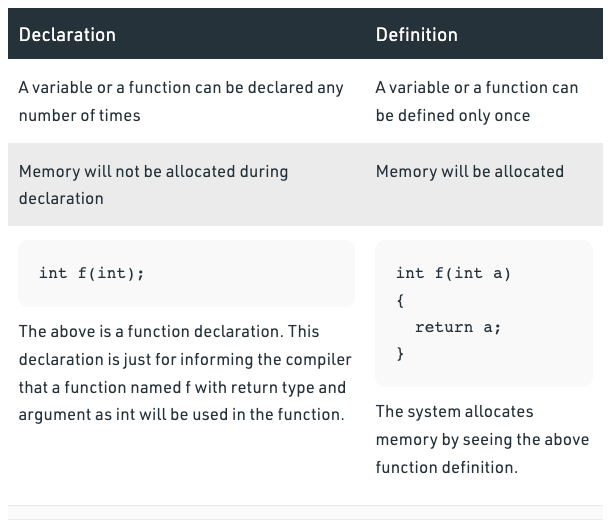
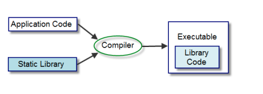
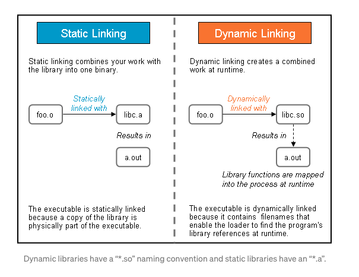
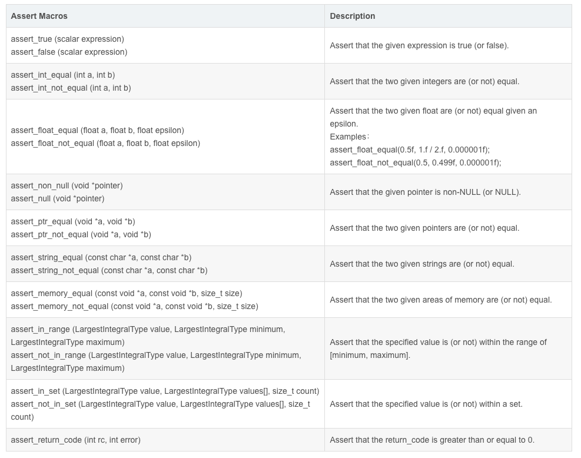

# Week 7


`gcc -E` for the preprocessor

`gcc -S` generate the .s file   (Assembly code)

`gcc -c` generate the .o file   (machine code)


`gcc sourcefile.c` => generate a `a.out` (linking several `.o` file. ) 

Q: Why do we need to link several `.o` file, rather than combine all the code then generate the executable directly ?

A: Assuming each `.o` file is a unit, we can just use some of them  if we need in other programs 


- `-c` tells GCC to compile a source file into a `.o` object file. **Without that option**, it'll default to compiling *and linking* the code into a complete executable program, which only works if you give it all your `.c` files at the same time. To compile files individually so they can be linked later, you need `-c`.
- `-o` sets the name of the output file that GCC produces. You're using it when linking object files to make a complete program, and the default output filename for that is `a.out`. If you don't want your program to be called `a.out`, you use `-o` to specify a different name.

 

`objdump` : extract assembly from object files

`objdump -M intel -S a.o`


## P1: Preprocessor

`gcc -E`

Preprocessor commands are lines starting with # (hash)

1. `#include`

   Include text from another file into your program file, copy and paste

   + < > (angle bracket): system included directories

   + " " (double quote): user included directories 

     + headers

       Usually end with `.h`  (externs / typedefs / struct definitions/ function declarations)

     + Flag `-I` to specify the path

   

2. `#define`

   1. Replace the string 

      ```c
      // (add brackets) when define
      #define LINES (10+10)
      
      // before
      char page[LINES]
      
      // after
      char page[(10+10)]
        
      // without brackets, what happen ?
      int a = LINES * 10
      ```
   
   2.  Macro
   
      ```c
      #define min(a,b) ((a) < (b) ? (a):(b))
      
      y = min(a++,b) /* before */    
      y = ((a++) < (b) ? (a++):(b) /* after */
      ```
   
      ```c
      #include <stdio.h>
      #define min(a, b) ((a) < (b) ? (a) : (b))
      
      int main(){
          int a = 1, b = 2;
          int y = min(a++, b);
          printf("y:%d  a: %d, b: %d", y, a, b);
      }
      ```
      
      ```
      >> y: 2 a: 3 b: 2
      ```
      
      ```c
      int y = ((a++) < (b) ? (a++):(b))
               
      /*
        1. compare  a and b   
        2. a++
        3. assign `a` to `y`
        4. a++
      */
      
      ```
      
      + Define Macro using command line
      
        ```shell
        $ gcc -DWIDTH=600 test.c
        ```
      
        ```c
        #define WIDTH 600
        // at the beginning of program
        // -D is the flag
        ```
      
        
      
      + Usage for # and ##

> Week7/ Q1


### Conditional inclusion

```c
// gcc -D EBUG prog.c
// -D is a flag == #define EBUG

/*
	SO if debug, we create a marco DEBUG(m) function to print DEBUF info
	else make the function invalid
*/


#ifdef EBUG
#define DEBUG(m) \
	printf("debug: %s at line %d in file %s\n", (m), __LINE__, __FILE__);
#else
#define DEBUG(m)
#endif

…
DEBUG("called proc fn");
…
```

#### Header Guards

```c
#ifndef MY_HEADER_FILE_H
#define MY_HEADER_FILE_H

// Code body for header file

#endif
```

> Week7/ Preprocessor code generation


## P2: Linker


compiled object file ===> translation unit. 

The linking stage merges these object files together to generate the executable.

Since we often need to use variables and functions that are declared in another translation unit, C
defines the concept of linkage. The job of the linker is to connect these translation units together

+ A variable or function has <u>internal</u> linkage if it is defined in the current translation unit.
+ A variable or function has <u>external</u> linkage if it is defined in another translation unit.
+ <u>Any variable or function that is declared static</u> has <u>internal</u> linkage


### Global variable

The valid range is **from the position where the variable is defined** to the end of the source file

<u>Use `global` before defined or in other files ==> `external`</u>


1. Use global in other files

```c
/****max.c****/
#include <stdio.h>
/*external*/
extern int g_X ;
extern int g_Y ;
int max()
{
    return (g_X > g_Y ? g_X : g_Y);
}


/***main.c****/
#include <stdio.h>
/*global*/
int g_X=10;
int g_Y=20;
int max();
int main(void)
{
    int result;
    result = max();
    printf("the max value is %d\n",result);
    return 0;
}
```

An interesting usage for `extern` : use global before defined

```c
#include <stdio.h>
int max(int x,int y);
int main(void)
{
    int result;

    int g_X;   // how to make g_X to access 10
    int g_Y;   // how to make g_Y to access 20
    result = max(g_X,g_Y);
    printf("the max value is %d\n",result);
    return 0;
}

/*two global variables*/
int g_X = 10;
int g_Y = 20;

int max(int x, int y)
{
    return (x>y ? x : y);
}
```


### Static variable

+ **Static local variables**, defined in the function body, can only be used in this function, and other functions in the same document cannot be used. Since this variable always exists in the static area of the memory, even if the function ends, the value of the static variable will not be destroyed, and the value can still be used when the function is used next time.

  

> Week7/Linker and External

> Week7/Q2


<u>**Memory**</u>




(Skip) For **static global variables**, the scope is limited to the file in which the variable is defined, and other files cannot use them even if they are declared with extern. To be precise, the scope starts from the definition and ends at the end of the file, and the lines of code before the definition cannot use it. If you want to use it, you have to add extern in front.


(Skip => extension)

### Static library(.a) VS shared library(.so)

#### Static library



During linking, no need to pull in multiple object files.

> Week7/Q7


#### Shared library

Two ways:

1. Manually linking        											 `Week7/Q7`

2. Dynamic Loading (need to free the resource).  ` Week7/Q8`

   + Open file

     ```c
     void *dlopen (const char *filename, int flag);
     ```

   + Get function in library

     ```c
     /*
     	@param handle: handleptr for library file
     	@param symbol: function name
     */
     void *dlsym(void *handle, char *symbol);
     ```

   + close file

     ```c
     int dlclose (void *handle);
     ```

   + check error

     ```c
     const char *dlerror(void);
     ```


### Pros and cons

Try delete the static lib, does `a.out` still works ?         

Try delete the shared lib, does `a.out` still works ?		


**Static libraries**, are locked into a program at compile time.

**Dynamic libraries** the programmer is referencing that library when it needs to at runtime



+ Size, which is larger ?
  + Static
+ Change lib, which one need relinking and recompilation ?
  + Static


## P3: MakeFile

### Basic

If you want to run or update a task when certain files are updated, the `make` utility can come in handy. 

1000.c


1.c 2.c 3.c .... 1000.c    ==> gcc 1.c 2.c <u>3.c</u> ... 1000.c ==> 


*"A makefile is useful because (if properly defined) allows <u>recompiling only what is needed when you make a change</u>.In a large project rebuilding the program can take some serious time because there will be many files to be compiled and linked and there will be documentation, tests, examples etc. "*

```makefile
# format of Makefile
<target_name>: [dependencies]
[tab]	<command>
```

```shell
$ make       # build the first rule containing dependencie
$ make [target name]
```

See => `MakeFileTest/SimpleExample`

+ Target is necessary
+ Dependencies and commands are option


`Makefile`

```makefile
hello.out: hello.c
	gcc hello.c -o hello.out
```

```shell
$ make
>> gcc hello.c -o hello.out

$ make
>> make: `hello.out` is up to date 

# check => hello.c change ? => No, no need to build again   (by timestamp)
```


#### Target

1. real target => Like the previous example
2. phony target (fake target) ?

`Makefile`

```makefile
clean:
      rm -f *.out
```

```shell
$ make clean
```

The target of this is `clean`, it's not a file name but an operation: cleaning the code with suffix `.out`

Run for any times. No dependencies ---> run command ---> `clean` does not exists ---> be able to run again for the target since task want to create `clean`

```shell
# what if there exists a file called clean ?
clean:
	rm *.o
# However, if there is a file named `clean` in  current directory, this command will not execute
```

So

```makefile
.PHONY: clean
clean:
	rm *.o
```


#### Example

```shell
# define some variables: <variable>=<value>
CC=gcc
CFLAGS=-g -std=c11 -Wall -Werror
TARGET=tasks					

.PHONY: clean
all: $(TARGET)     # use the variable

clean:
	rm -f $(TARGET)
	rm -f *.o

list.o: list.c
	gcc -c -g -std=c11 -Wall -Werror list.c -o list.o  # $^ : all dependencies,  $@ : target 
	
tasks.o: tasks.c
	$(CC) -c $(CFLAGS) $^ -o $@
	
tasks: tasks.o list.o
	$(CC) $(CFLAGS) $(LDFLAGS) $^ -o $@       
```


##### Test1

```c
/* 
	
	$^ : all dependencies
	$@ : target 
	$< : first dependency
	
*/
    
list.o: list.c
	$(CC) -c $(CFLAGS) $^ -o $@
  
	$ make list.o
>> gcc -c -g -std=c11 -Wall -Werror list.c -o list.o
  
/*

  Case1: 
    if we do not update list.c 
    `$ make list.o` twice ==> make: `list.o' is up to date.

    what if change list.c ?
    Make file can know the file changed and execute task again
    
  Case2:
  	What if dependencies not exist ? try to build the dependency (seach tasks whose target is dependency, like
  	run recursively)
*/
```

> Week7/MakeFileTest/Test1
>
> Week7/Q3 


# Do Q3 10 mins  + 5 mins break 

# Back at 9:10;


The header file is used by the C compiler, not make.

`-I` specify the header file


## P4: Cmocka (For Test)

For someone do not know how to write `.sh` script, this is an alternative choice


Download the static library and header files from ed

```sh
gcc xxx.c xxx.c  -L .  -l cmocka-static
    # -I: path of .h file, 
    # -L: path of .a file,
    # -l: name of lib, if name start with "lib", ignore "lib" and ".a"
```


1. Simple 

   ```c
   #include <stdarg.h>
   #include <stddef.h>
   #include <setjmp.h>
   #include <stdint.h>
   #include "cmocka.h"
   
   /* A test case that does nothing and succeeds. */
   static void null_test_success(void **state) {
     
     // test content
       (void) state; /* unused */
   }
   
   
   
   int main(void) {
       const struct CMUnitTest tests[] = {
           cmocka_unit_test(null_test_success),
       };
   
       return cmocka_run_group_tests(tests, NULL, NULL);
   }
   
   ```

2. header files

   ```c
   #include <stdarg.h>
   #include <stddef.h>
   #include <setjmp.h>
   #include <stdint.h>
   
   #include "cmocka.h"
   ```

3. setup and teardown and state

   ```c
   /* Like Junit BeforeAll*/
   static int setup(void **state) {
       int *answer = malloc(sizeof(int));
       assert_non_null(answer);
       *answer = 42;
       *state = answer;
       return 0;
   }
   
   static int teardown(void **state) {
       free(*state);
       return 0;
   }
   
   static void int_test_success(void **state) {
       int *answer = *state;
       assert_int_equal(*answer, 42);
   }
   
   /*
   	the void **state pointer is the address 
   	to the void *initial_state variable in the CMUnitTest structure
   */
   int main(void) {
       const struct CMUnitTest tests[] = {
           cmocka_unit_test_setup_teardown(int_test_success, setup, teardown),
       };
       return cmocka_run_group_tests(tests, NULL, NULL);
   }
   
   ```

   

4. CMUnitTest structure

   ```c
   struct CMUnitTest {
       const char *name;                /* name of test */
       CMUnitTestFunction test_func;    /* function pointer for test function */
       CMFixtureFunction setup_func;    /* fp for setup function */
       CMFixtureFunction teardown_func; /* fp for teardown function */
       void *initial_state;             /* private data for test */
   };
   ```

   Some marco

   ```c
   #define 	cmocka_unit_test(f)   { #f, f, NULL, NULL, NULL }
   #define 	cmocka_unit_test_setup(f, setup)   { #f, f, setup, NULL, NULL }
   #define 	cmocka_unit_test_teardown(f, teardown)   { #f, f, NULL, teardown, NULL }
   #define 	cmocka_unit_test_setup_teardown(f, setup, teardown)   { #f, f, setup, teardown, NULL }
   #define 	cmocka_unit_test_prestate(f, state)   { #f, f, NULL, NULL, state }
   #define 	cmocka_unit_test_prestate_setup_teardown(f, setup, teardown, state)   { #f, f, setup, teardown, state }
   
   
   int main(void) {
       const struct CMUnitTest tests[] = {
           cmocka_unit_test_setup_teardown(int_test_success, setup, teardown),
       };
       return cmocka_run_group_tests(tests, NULL, NULL);
   }
   
   ```

5. Asserations

   

> Week7/Q4


## Q4 => 10 mins Back at 9:46


```shell
$ gcc 1.simple_test.c -L . -l cmocka-static
$ gcc key_value_test.c key_value.c -L . -l cmocka-static
```

