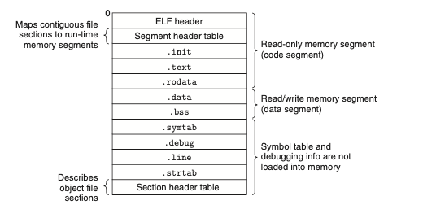
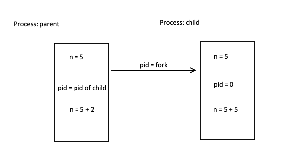

# Week8


## Before Start: Executable Object Files 

(Just know the general idea)

`gcc hello.c -o hello.out`

|  |
| :----------------------------------------------------------: |
|          <b>Typical ELF executable object file.</b>          |


`readelf --sections a.out` => check all headers info

<u>It stores in disk</u>

> Try hello.c


```

CHANGE_THIS 
11010

.data [11000 , 11014]  ==> 11010
11010 - 11000 = 10

file offset => 1000
1000 + 10 = 1010 file offset for CHANGE_THIS

2A = 42 in decimal
```


`./hello.out` => Loading Executable Object Files

The loader copies code and data in the executable object file from disk into memory then runs the program by jumping to its first instruction.

The process of copying the program into memory and then running it is known as *loading*.


When the loader runs, it creates a memory image


## P1: Process Memory (Virtual)


<center class="half">
    
</center>

BSS: store uninitialized global variable.


### Process

In the computer, we can run lots of programs at the same time. Like each page in chrome.These things are like processes. Each of them has their own memory. The OS is aimed to organise them.

`Own memory ? but the memory address for each process looks same ?  => virtual address => see later` 


#### How to organise processes (Kernel)

+ Regardless of the application programs or the operating system, they are binary program instructions executed by the CPU, and all instructions that a CPU can execute are in its instruction set. 

  + So how to distinguish the OS from normal programs ?

    + We have some instructions related with managing computer resources which can only be executed by OS (like the input and output for devices). These instructions are stored in the Kernal.

    + However, many applications need access to these components, so **system calls** are made available by the operating system to provide well-defined, safe implementations for such operations.


As we learnt before, user can use **<u>system calls</u>** to invoke the functions of OS.

1. **Process control** (`fork`, `execl`)

2. **File management**

3. Device management

4. Information maintenance

5. Communication

6. Protection


## Virtual Address 

*“A virtual address is **a binary number in virtual memory that enables a process to use a location in primary storage (main memory) independently of other processes and to use more space than actually exists** in primary storage by temporarily relegating some contents to a hard disk or internal flash drive.”*


+ The CPU of the single-chip microcomputer directly operates the "physical address" of the memory
  + Can not run two programs simultaneously, since the second one will overwrite the first one


+ How does the operating system solve this problem ?

  + "Isolate" the addresses used by the different processes in "physical address"

  + Every process has its own **"virtual address"**, <u>OS mapping it to "physical address"</u>

    + In fact, everyone's virtual address is the same, but the distribution to physical address memory is not the same

      **note**: The real situation is a bit different according to the mapping mechanism. (Picture2)
      
      

      <center class="half">
          
      </center>
      
      
        

​						**note**: However Kernel is special, it **maps** to the same "physical address".

​							

​						**note**: What if too many processes, and we do not have enough physical memory ?

​									+ Relegate some contents to a hard disk or internal flash drive									


​				

## P2: Basic operations

### Execl

Replace the memory image of  a process with a new program

```c
/*
	@param path : the path of program => load into the user space including code section
	@param arg  : argument, the end of arugment should be (char*) 0 or (char*) NULL
*/
int execl(const char *path, const char *arg, const char *arg,… (char *)0)
```


+ exec does not create a new process
+ if exec is successful it doesn’t return, your program is terminated and the other program’s main function is called
+ if it does return, and the return result is negative, then the program was not found
+ if it returns zero or greater, then the exec function itself has failed! 


If you want to pass arguments......always start from `0` => what is the 0 ? => 


### Fork

Duplicate a memory image

```c
#include <sys/types.h>
#include <unistd.h>

pid_t fork(void);
```

+ both the parent and the child programs run in parallel
+ the return value from the fork function is different for the parent and the child
  + 0 in the child process
  + the process id of the child in the parent process
  + -1 in the parent process if the fork failed


Example

```c
#include <stdio.h>
#include <unistd.h>
#include <sys/wait.h>
#include <sys/types.h>


int main() {

	int n = 5;
	puts("we're going to fork!");
	pid_t pid = fork();

	if(pid < 0) {
		perror("Unable to fork process");
		return 1;
	}

	// child
	if(pid == 0) {
		puts("I am the child!");
		n = n + 5;
		printf("%d\n", n);
	} else {
		//parent
		puts("I am the parent");
		n = n + 2;
		printf("%d\n", n);
    
		wait(NULL);
	}

	return 0;

}
```



+ The only difference is PID in kernel space

> Week8/Q1, Q2, Q3, Q4


## 5 mins break


1. Child ask  ==> send signal to parent to get response
2. Parent ask ==> send signal to child to get response


Run in parallel, to make sure the order => use `pause()`


Signal may be lost => comment the `pause()` in child


## Q3, Before 9:30, try this 

main.c => parent process


While (1){

​	get some command from input 

​	if command == 'exit':

​			break


​	fork to get a child

​		child 

​			execl (program (/usr/bin/echo), pass the arguments) = > execute echo hello

​		Parent just wait for this child

}


Example output

```
./a.out

> echo hello
  hello
> cat h.txt
	content of your file
> exit 


```


## Try this one for 15 minutes Back at 5:22


​	Child process => echo hello (child)

​	Child process => cat hello.c (child)


## Signal

See `Week5, T5`

> Week8/Q2

Signal can be lost


# Try Q4  5 mins to read the Read and come up with idea is enough(5m). 

## Edit from Q3


Back at 9:50 


###  Wait

the parent can wait until the child exits and get the exit value

```c
#include <sys/types.h>

// waits for any child process to exit
pid_t wait(int *status)
 
// waits for a specific process to exit
pid_t waitpid(pid_t pid, int *status, int options)

```


+ Why parent need wait until the return of child process ？

  + An **orphan process** is a computer process whose `parent process` has finished or terminated, though it (child process) remains running itself.     ---> it's fine. Init process will do the rest work

  + A **zombie process** or defunct process is a process that has completed execution but still has an entry in the process table as its parent process didn't invoke an `wait()` system call.

    process id will be occupied, but the number of PID is limited.

    How to kill zombie process:

    Kill his parent ===> zombine -> orphan

    

+ Wait without blocking

  `waitpid(pid, NULL, WNOHANG)`


