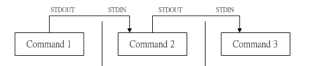

# Week 9


# Start AT 8:05


## P1: Communicating Processes

1. signals

   + **<u>(lossy)</u>**  --> multiple signals (protocal: signal sent and reply)

   + only one `int`: limited

2. **pipe**

3. Files 

4. Shared memory 


## P2: Pipe

### Basic

+ A Pipe is a technique used for inter process communication. 
+ A pipe is actually a file that exists only in memory. (Unnamed pipe)

+ A pipe descriptor, has an array that stores two pointers, one pointer is for its input end and the other pointer is for its output end.
+ **queue**  


```shell
$ ls -al /etc | less
```




### Implementation of Kernel buffer


+ The number of signals are limited, but we can create a lot of pipes, why need ? Eg. Download 

> Part1, example


### Unnamed pipe VS named

| Named Pipe                                                   | Unnamed Piped                                                |
| ------------------------------------------------------------ | ------------------------------------------------------------ |
| `mkfifo ( char *path, mode_t access_mode)`                   | `pipe (int fd[2]);`                                          |
| <u>They can be used even among unrelated processes.</u>      | <u>They can be used only between related processes.</u>      |
| Once created, they exist in the file system independent of the process, can be used by other processes. | Un-named pipes vanish as soon as it is closed or one of the related processes terminates. |


Bad:

> Part2/bad

Correct: 

> Week9/Lecture/comms.c


Named: 

> Part3 (unlink)


+ Why close some fd ?
  + This is not only to reduce the resources occupied by file descriptors, but also to ensure the normal operation of communication


## Try Q2 until: 9:20, 


> Week9/Q1, Q2, Q3


### Reminder

#### Accessible


#### `n` pipes for `n` children VS 1 pipe for all children ?


## P3: File

Set a timeout for blocking

```c
/*
	Treat fd as vector, 0000000.
	If we are interested in the fd 4 => 0001000
*/

int select( int nfds, fd_set *readfds, fd_set *writefds, fd_set *exceptfds, struct timeval *timeout);

/*
  nfds = max(fd) + 1

  FD_ZERO(): set all into 0
  FD_SET(): set fd into 1
  FD_CLR(): set fd into 0
  FD_ISSET(): check fd is 1
*/
```

Example.

> Week9/Lecture/select.c 


### Non-blocking IO VS Blocking IO


+ **Blocking IO** means that a given thread **cannot do anything** more until the **IO is fully received** (in the case of sockets this wait could be a long time)

+ **Non-blocking IO** means an IO **request is queued straight away** and the **function returns**. **<u>The actual IO is then processed at some later point by the kernel.</u>**

  + Set non-blocking
  
    + If you call `open` to obtain a file descriptor, you can specify the `O_NONBLOCK` flag
  
    + For an open descriptor, `fcntl` can be called, which sets the `O_NONBLOCK` file status flag.
  
      ```c
      fcntl(fd, F_SETFL, fcntl(fd, F_GETFL) | O_NONBLOCK);
      ```
  
  ​		


## P3: Shared Memory

a shared memory segment is created by the kernel and **mapped** to the data segment of the address space of a requesting process. A process can use the shared memory just like any other global variable in its address space.


+ Shared memory (DO large file IO) is one of the fastest ways to share data between processes --> compared with pipe
+ If a process is writing data to the shared memory area, other processes should not read or write the data until it has completed this step.

+ Fast, but race conditions may occur if memory accesses are not handled properly.


### POSIX

For mmap


#### Mmap file (read and write)

After an ordinary file is mapped to the process address space, the process can access the file in the same way as accessing memory, without the need for other kernel-mode system calls (read, write) to operate.

> Week9/shared-memory 


#### Mmap between child and parent

If you create your children via `fork` then `mmap` with `MAP_ANONYMOUS | MAP_SHARED` is by far the easiest way .

> Week9/shared-memory

> Week9/Q4


#### Mmap between independent processes

shm_open is used for providing a name for the shared memory for independent processes to use.

> Week9/shared-memory 


`/dev/shm`


