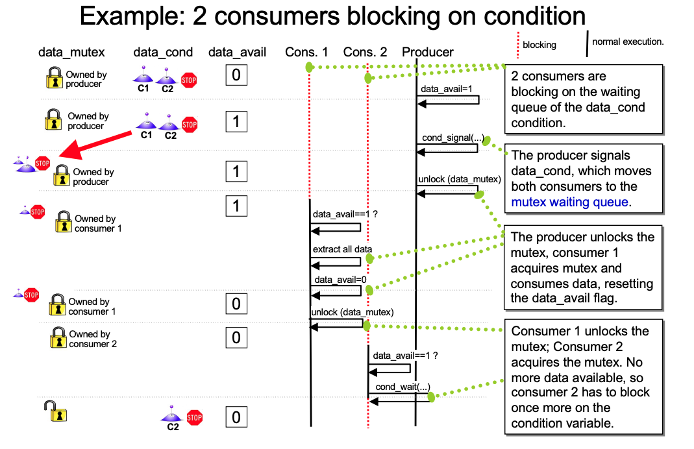
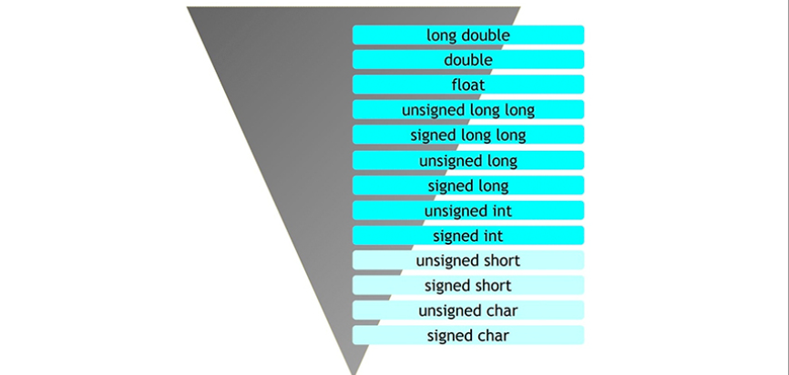

# Week 12


## P1: Barriers

**A barrier** is a synchronization point at which a certain number of threads must arrive before any participating thread can continue

```c
pthread_barrier_t mybarrier;

/*
	[a pointer to a barrier variable], [a pointer to barrier attributes], [number of threads]
*/
pthread_barrier_init(&mybarrier, NULL, number_of_threads);

/*
	block until specific number of threads reach this line
*/
pthread_barrier_wait(&mybarrier);

int pthread_barrier_destroy(pthread_barrier_t *barrier);
```


## P2: Condition variables


Global variable data_avail is used to tell the consumer that data is available.

- data_avail = 1 means “data is available”.   
- data_avail = 0 means “queue is empty”.  

To avoid race conditions we use mutex “data_mutex” to synchronize access


### Why we need condition var

-- **Busy waiting**


### How to use condition var

Some functions

```c
/* 
	For waiting/sleeping, until the specific condition is signaled
	
	The most important function !!!!!!!!
	During waiting time, mutex is unlocked. When return, mutex locks again.
	So, before this function, we need lock the mutex. After this, we need unlock the mutex

*/

lock(mutex)
  
pthread_cond_wait(condition, mutex);   
// wait until some condition is sat


/*
	For waking up other threads
*/


/*
	Wake up (at least) one thread waiting on the condition variable.
	Must be called after mutex is locked, and must unlock mutex thereafter.
*/
pthread_cond_signal(condition);

/*
	Used when multiple threads blocked at the condition.
	Wake up all threads blocked at the condition.
*/
pthread_cond_broadcast(condition);
```


**Producer**


**Consumer**


**Question : Why need while loop ?**

+ case: <u>many threads are waiting</u>

```c
void *consumer(void *)
{

	pthread_mutex_lock(&data_mutex);

	while( data_avail == 0 ) {
		// sleep on condition variable:
		pthread_cond_wait(&data_cond, &data_mutex);
		/*
			1. Assume T1 is waiting => data_mutex unlock (why?)
					So T2 can get the data_mutex and wait as well.  ==> at this stage data_mutex is unlocked (Both threads block at wait, haven't return yet)
					T1, T2 => blocking => data_mutex freed
					
      2. Producer only enqueue 1 element, send signal. Two consumers are put in the mutex wait queue
      
      3. Only 1 consumer can get the lock. Assume T1 get the data_mutex, T2 still waits, but it is waiting for data_mutex to be available.
      		
      4. T1 Extract data from queue and unlock, it will set data_avaiable 0
      
      5. So T2 `wait` return and lock it again,
      		but data_avail == 0, so it can not break the loop
      		execute pthread_cond_wait(&data_cond, &data_mutex); again, blocking and unlock mutex
		*/
	}


// woken up, execute critical section:
// Extract data from queue;
if (queue is empty)
	data_avail = 0;
pthread_mutex_unlock(&data_mutex);

	consume_data();
}
```




> Some Problem: Alice bob email example


## Thread pool

Most Web servers need to deal with a lot of requests in a short time. These requests need a little time to execute.

The normal way is when receiving a request, create a thread, 
do something, join/destroy the thread. Since the high frequency requesting, 
we have to spend a lot of time on creating and join threads.

**Thread pool can fix that**: 
After the program start, 
we create some threads and make them blocked/waiting. 
When there is a request, thread pool will choose a free one to do work. After finishing,
we do not destroy that thread, however, we make it blocked again and put back to thread pool 


##  Strict aliasing, restrict 

Two pointers are said to alias when they are used to access the same underlying region of memory.

```c
int i = 0;
int *a = &i;
int *b = &i;
```


type punning is when you have two pointers of different type, both pointing at the same location

```c
// BAD CODE
uint32_t data;
uint32_t* u32 = &data;
uint16_t* u16 = (uint16_t*)&data; // undefined behavior
```

However, union is fine.


"Strict aliasing is an assumption, made by the C (or C++) compiler, that dereferencing pointers to objects of different types will <u>never</u> refer to the same memory location (i.e. alias each other.)"


What about the same type


### Example

```c
int foo(int *a, int *b)
{
	*a = 5;
	*b = 6;
	return *a + *b;
}

/*
  1. 11
  2. 12 => a is changed into 6
*/
```

```assembly
foo:
	movl $5, (%rdi)			# 5 to *a
	movl $6, (%rsi)			# 6 to *b
	movl (%rdi), %eax		# reload *a, since last line may change the value
	addl $6, 	%eax			# add 6
```


After `restrict`

```c
int rfoo(int *restrict a, int *restrict b)
{
	*a = 5;
	*b = 6;
	return *a + *b;
}
```

```assembly
foo:
	movl $11, %eax    # During compliation,
	movl $5, (%rdi)		# 5 to *a
	movl $6, (%rsi)		# 6 to *b
```

`######## Week12/Q3 ##########`


## Casting and promotion

Promotion

+ If an integer type is used in an operation with another integer type of greater size (sizeof), the
  original type is promoted (casted) to the larger type

+ If a signed integer type is used in an operation with an unsigned integer type, the unsigned
  integer type "wins" and the signed type is promoted (casted) to the unsigned type.

  ```C
  #include <stdio.h>
  int main(){
  	unsigned int a = 1;
    signed int b = -3;
    int c;
    (a + b > 0) ? (c = 1): (c = 0);
    printf("%d\n", c);
    // a + b => unsigned, big/small(overflow)
  }
  ```


```c
const char c = 'A';

void foo(const char** ptr)
{
   *ptr = &c; // Perfectly legal.
  // Here *ptr is const char* => legal
  // But at the same time, the ptr in main scope will pointes to c as well
}

int main()
{
   char* ptr = nullptr;
   foo(&ptr);  // When the function returns, ptr points to c, which is a const object.
   *ptr = 'B'; // We have now modified c, which was meant to be a const object.
}
```





