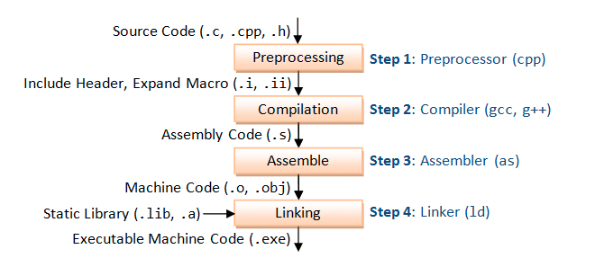
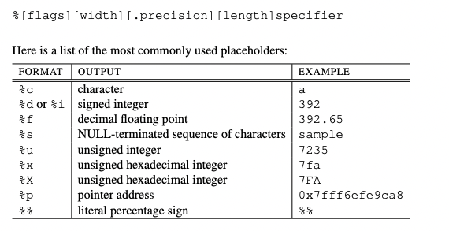
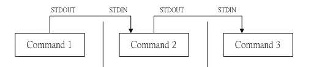
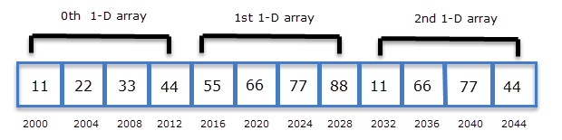

# Week 3


Email: jiahao.chen1@sydney.edu.au 


# Starting at 8:05

## No attendance 


C11 standard and enable all compiler <u>warnings</u> with -Wall.

```c
-std=c11 -Wall
```


## Function in C

1. The C language code is executed from top to bottom. In principle, the function should appear before the function call, otherwise an error will be reported.

   ***Valid***

   ```c
   #include<stdio.h>
   
   void myfunc(int num){ 
       printf("%d\n", num);
   }
   
   int main(){
       myfunc(1);
       return 0;
   }
   ```

   ***implicit declaration***: compiler has not seen a declaration ("*prototype*") yet.

   ```c
   #include<stdio.h>
   
   int main(){
       myfunc(1);
       return 0;
   }
   
   void myfunc(int num){ 
       printf("%d\n", num);
   }
   ```

   

2. What if we want define function after main() ?

   ```c
   dataType  functionName( dataType1 param1, dataType2 param2 ... );
   ```

   ​	A <u>function declaration</u> tells the compiler about the number of parameters function takes, data-types of parameters, and return type of function. 

   The reason modern compilers give warnings on an attempt to call a function before seeing a declaration is that a declaration allows the compiler to check if arguments are of the expected type. 
   
   ```c
   #include<stdio.h>
   
   void myfunc(int num);  //1
   
   int main(){
       myfunc(1);
       return 0;
   }
   
   void myfunc(int num){ 
       printf("%d\n", num);
   }
   
   // no 1 ==> implicit declaration
   ```
   
   
   
   

## Preprocessor

In the previous program, we use the function `printf` as well.

But where is the `function declaration` and `definition`/`body` for `printf` ?


***Declarations***




> .exe is in windows. Linux ,default a.out after linking 


Preprocessor commands are lines starting with # (hash)

+ Include header files: copy and paste

   `extern` means the function definition are located in other file

+ Expand macro: replace the macro 

+ Try to compile with flag `-E`

1. `#include`

   Include text from another file into your program file, copy and paste

   + < > (angle bracket): system 

   + " " (double quote): user 

     + headers

       Usually end with `.h`  (externs / typedefs / struct definitions/ <u>function declarations</u>)

     + Flag `-I` to specify the path

   

2. `#define`

   1. Replace the string 

      ```c
      // (add brackets) when define
      #define LINES (10+10)
      
      // before
      char page[LINES]
      
      // after
      char page[(10+10)]
        
      // without brackets, what happen ?
      int a = LINES * 10
      ```

   2. Macro 

      ```c
      #define min(a,b) ((a) < (b) ? (a):(b))
      
      y = min(a++,b) /* before */    
      y = ((a++) < (b) ? (a++):(b) /* after */
      ```

      ```c
      #include <stdio.h>
      #define min(a, b) ((a) < (b) ? (a) : (b))
      
      int main(){
          int a = 1, b = 3;
          int y = min(a++, b);
          printf("y:%d  a: %d, b: %d", y, a, b);
      }
      ```

      ```
      >> y: 2 a: 3 b: 3
      ```

      ```c
      int y = ((a++) < (b) ? (a++):(b))
               
      /*
      	a++: do other opeation firstly, then ++
      	
        a++ < b   =>    a < b ? Yes  Then a++  a(2)  
        y = a++   =>  	y = a(2)     Then a++  a(3)
      */
      
      ```

      + Define Macro using command line

        ```shell
        $ gcc -DWIDTH=600 test.c
        ```

        ```c
        #define WIDTH 600
        // at the beginning of program
        // -D is the flag
        ```


      ```
      int a = 1;
      int b = a++;
      ```

      

***definition***

So the declaration is in header files.


+ During linking : Link the libc 

  

```c
// (here dynamic linking => know the position of definions, when executing, find it)
// libc is loaded at runtime containing definitions of functions.

// libc is linked automatically, but if you create your own library, you need to link it explicitly.
```


More about linking is Week7

```shell
$ gcc --print-file-name=libc.a
$ gcc --print-file-name=libc.so
```


**Undefined Reference**

> An “Undefined Reference” error occurs when we have a reference to object name (function, variable, etc.) in our program and the linker cannot find its definition when it tries to search for it in all the linked object files and libraries.

```c
#include<stdio.h>

void myfunc(int num); 

int main(){
    myfunc(1);
    return 0;
}


// no 2 ==> Undefined Reference
```


## C Library functions

For the details, refer to `man 3 [function-name]`, eg `man 3 printf`

For ASCII, `man ASCII`


### <stdio.h>

#### 1. printf



```c
#include<stdio.h>

int main(){
    long double num = 1000.000512;
    printf("num is:%-15.3Lf end", num);
    /* 
    	width is 15, 
    	-: Left-justify within the given field width
    	.3: round the floating point value into 3 decimal places
    	L:
    	f: decimal floating point
    	
    	
    	>> num is:1000.001        end
		*/
}
```


#### 2. scanf

+ `scanf` uses the same placeholder format as the `printf` function

+ `scanf` requires you to pass a pointer to the variable as its parameters. => so `&`

+ <u>When reading strings with `scanf`</u>, you should provide a **width specifier**. This is because the buffer array we have declared is a fixed size. If a string longer than 20 characters was input (including the null terminator), scanf will write outside the bounds of array. This can potentially crash the program, overwrite the values of other variables or introduce a buffer overflow security vulnerability.

  ```c
  #include <stdio.h>
  int main(void) {
    int x;
    double y;
    char buffer[20];
    // Check all three inputs are given
    if (scanf("%d %lf %19s", &x, &y, buffer) != 3) {
      fprintf(stderr, "Invalid input\n");
      return 1;
    }
    printf("%d %f %s\n", x, y, buffer);
    return 0;
  }
  ```

  > Q2, Q4


## Back at 8:40, try q2 and q4


#### 3. Other useful functions

##### 3.1 `getchar()`:Read character from stdin

```c
#include <stdio.h>
int main()
{
    char c;
    c = getchar();
    printf("c: %c\n", c);
    return 0;
}
```

> Q1


## C Types and pointers

last week

> Tutorial Q3


## 


Q6: 5mins

Back at 5:15


### <math.h>

Why need specify `-lm` ？

(Dynamically linking) It is not linked by default. We need to specify the lib name by `-l`.  Like when we compile the program, we need to let it know where to find the definitions of functions at runtime.

However, `stdlib.h` and `stdio.h` are linked by default.


> Tutorial Q6


## Back at 9:50 (10mins) q9


> Q7, 8, 9, 10 ....

+ When we pass a pointer represents an array to function, pass the length as well. Since we only know the start of array according to the pointer, the end of array can be deducted from length.


## Q12

### Pipe




## Other func

##### 3.2 `char* fgets(char *str, int n, FILE *stream)`:  Read string

```c
// Read from stdin

#include<stdio.h>
int main(){ 
    char buffer[10];
    fgets(buffer, 10, stdin);
    puts(buffer);
}

/*
	stdin, stdout, and stderr are three data streams created when you launch a Linux command.
	#### Streams Are Handled Like Files ######
*/
```

```c
// Read from file

#include <stdio.h>
int main () {
   FILE *fp;
   char str[60];

   /* opening file for reading */
   fp = fopen("file.txt" , "r");
   if(fp == NULL) {
      perror("Error opening file");
      return(-1);
   }
   if( fgets (str, 60, fp)!=NULL ) {
      /* writing content to stdout */
      puts(str);
   }
   fclose(fp);
   
   return(0);
}
```


##### 3.3 `int sscanf(const char *str, const char *format, ...)`: Read by format

```c
#include <stdio.h>
#include <stdlib.h>
#include <string.h>

int main () {
   int day, year;
   char weekday[20], month[20], dtm[100];

   strcpy( dtm, "Saturday March 25 1989" );
   sscanf( dtm, "%s %s %d  %d", weekday, month, &day, &year );

   printf("%s %d, %d = %s\n", month, day, year, weekday );
    
   return(0);
}
```


### <stdlib.h>

##### 3.4 `int fprintf(FILE *stream, const char *format, ...)`: sends formatted output to a stream.

```c
#include <stdio.h>
#include <stdlib.h>

int main () {
   FILE * fp;

   fp = fopen ("file.txt", "w+");
   fprintf(fp, "%s %s %s %d", "We", "are", "in", 2012);
   
   fclose(fp);
   
   return(0);
}
```


### <string.h>

`strlen`, `strcpy`

```c
 char s1[] = "12345", *s2 = "1234";
 printf("%d\n", strlen(strcpy(s1, s2))); 


/*
	copy 1234\0 -> s1
	strlen exit when meets \0, not count \0 => 4
*/
```


## 2_D array

```c
#include <stdio.h>

int main(){
    char *ptr;               // pointer to char
    char (*ptr_array)[10];  // pointer to array    
  	/*
  		Different with 
  		char * p_array[10];  
  		
      p array, the elemnet in the array is pointers/addresses
  	*/


    char arr[10] = {'a', 'b', 'c', 'd', 'e', 'f', 'g', 'h', 'i', '\0'};

    ptr = arr; //  char*
    ptr_array = (char (*)[10]) arr; // cast into char(*)[]  // &arr


    printf("%p\n", ptr);

    // + sizeof (elemnet_pointer_points_to) 
    printf("%p\n", ptr + 1);  // element is char so + 1
    printf("%p\n", ptr_array + 1); // element is char[10], so + 10


    printf("%c\n", *ptr);  // deference char*. ==> get char,  get 'a'

    printf("%p\n", *ptr_array); // get an array ? How to access array ? we get address/pointer here ? what the type ???
    printf("%p\n", *ptr_array + 1); // the type seems to be char*


    printf("%c\n", **ptr_array);
    /*  
        Rule 6.3.2.1
        deference a pointer to array
        
        "array of type" is converted to an expression with type "pointer to type" that points to the initial element of the array object...
    */


    char twoD[10][20];
		/*
			We know that the name of the array is a constant pointer that points to the 0th element of the array. In the case of a 2-D array, 0th element is a 1-D array. So the name of the array in case of a 2-D array represents a pointer to the 0th 1-D array. 
		
		*/
  
    // twoD is a pointer points to array[20], type is a pointer to array;     

    // twoD + 0  ==> pointer to first array[20], the type of pointer is (char (*)[]) 
    // twoD + 1  ==> pointer to second array[20], the type of pointer is (char (*)[]) 

    // scanf("%s\n", char* ptr); // type is char* (a pointer to char), not a pointer to array

    // scanf("%s\n", *(twoD + 0)); // when deference a pointer to array, we get the pointer points to the initial elemnet, type is char*
    scanf("%s", *(twoD + 0));
    printf("%s\n", twoD[0]);
}
```


 


