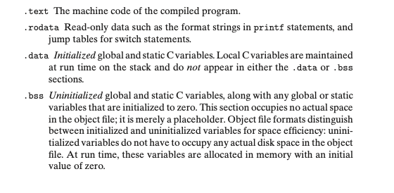
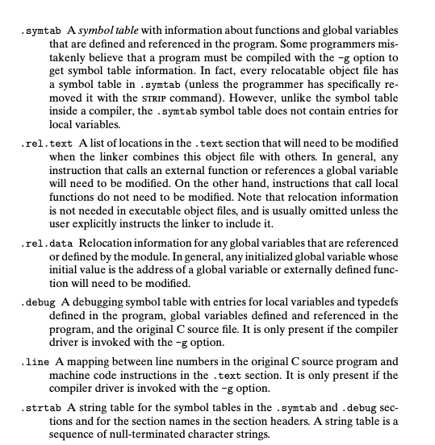

The loader copies the code and data in the executable object file from disk into memory and then runs the program by jumping to its first instruction, or *entry point*. This process of copying the program into memory and then running it is known as *loading*.

The .init section defines a small function, called _init, that will be called by the program’s initialization code. 

ELF executables are designed to be easy to load into memory, with contigu- ous chunks of the executable file mapped to contiguous memory segments. This mapping is described by the *program header table*.

